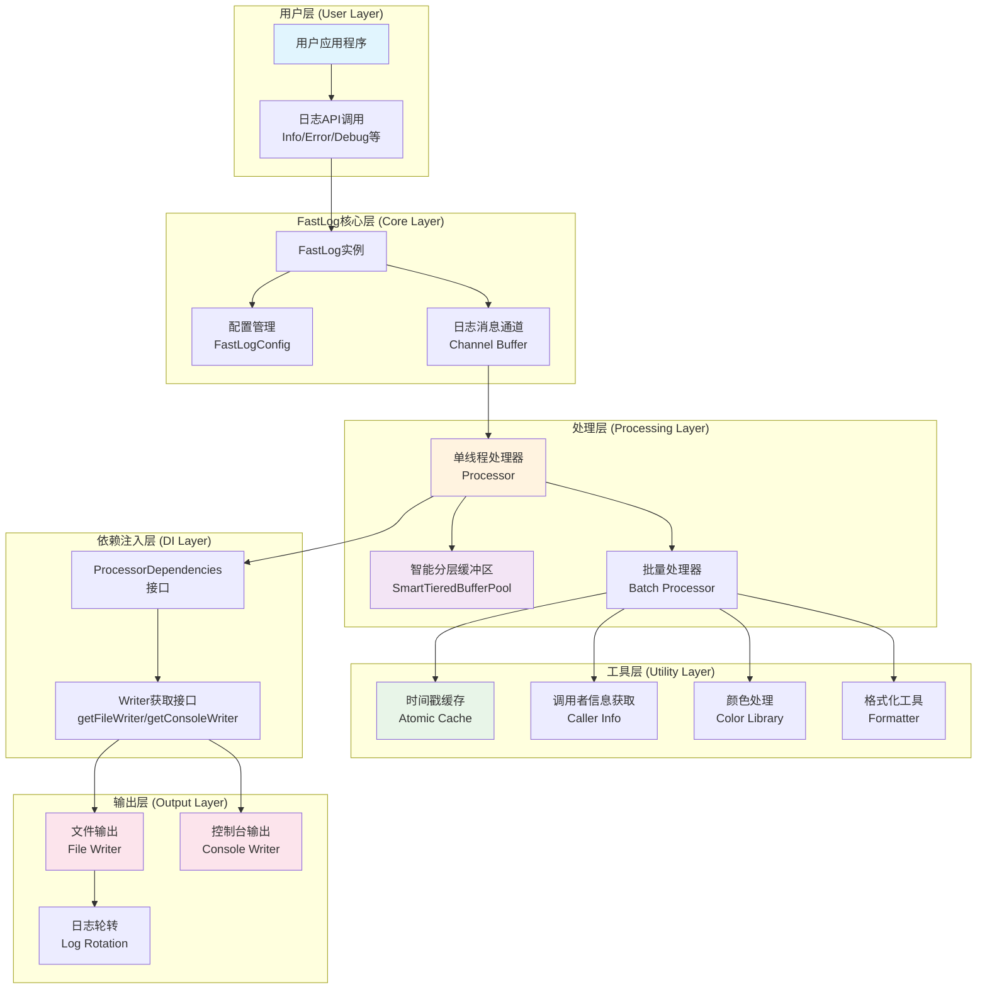
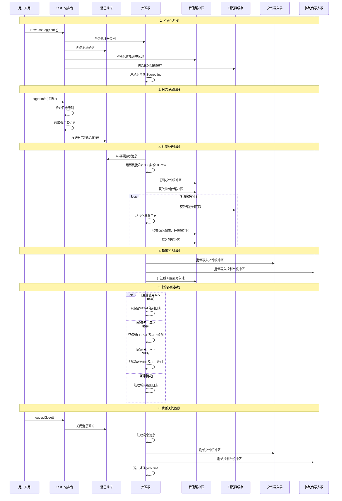

# Package fastlog

**导入路径**: `gitee.com/MM-Q/fastlog`

FastLog是一个高性能的Go语言日志库，提供了灵活的配置选项和多种输出格式。

## 模块说明

### config.go - 日志配置管理模块
定义日志配置结构体及配置项的设置与获取方法，负责管理FastLog的所有可配置参数。

### fastlog.go - FastLog日志记录器核心实现
提供日志记录器的创建、初始化、日志写入及关闭等核心功能，集成配置管理、缓冲区管理和日志处理流程。

### interfaces.go - 接口定义模块
定义处理器所需的最小依赖接口，用于打破循环依赖并提高代码的可测试性。

### logger.go - 日志记录方法实现
提供不同级别日志的记录方法（带占位符和不带占位符），实现日志级别过滤和调用者信息获取功能。

### processor.go - 单线程日志处理器实现
负责从日志通道接收消息、批量缓存，并根据批次大小或时间间隔触发处理，实现日志的批量格式化和输出。

### tools.go - 工具函数集合
提供路径检查、调用者信息获取、协程ID获取、日志格式化和颜色添加等辅助功能。

### types.go - 日志系统核心类型定义
定义FastLog的核心数据结构、常量和枚举类型，包括日志级别、日志格式、路径信息和日志消息结构体等。

## 核心架构概览

### 系统架构图



### 工作流程图



### 核心组件说明

#### 1. 智能分层缓冲区系统
- **文件缓冲区**: 32KB → 256KB → 1MB，适合批量I/O操作
- **控制台缓冲区**: 8KB → 32KB → 64KB，适合实时显示
- **90%阈值触发**: 达到容量90%时自动升级到更大缓冲区
- **对象池管理**: 使用sync.Pool实现缓冲区重用，GC时自动清理

#### 2. 原子时间戳缓存
- **快路径无锁**: 使用atomic.LoadInt64()原子读取，99%的调用无锁
- **双重检查锁定**: 更新时使用轻量级mutex保护
- **3-5倍性能提升**: 相比传统读写锁方案显著提升性能

#### 3. 依赖注入架构
- **接口隔离**: 通过ProcessorDependencies接口避免循环依赖
- **可测试性**: 便于单元测试和模拟测试
- **松耦合设计**: 各组件职责清晰，易于维护和扩展

#### 4. 智能背压控制
- **动态负载感知**: 根据通道使用率自动调整处理策略
- **分级丢弃策略**: 优先保留高优先级日志，智能丢弃低优先级日志
- **内存保护**: 防止高负载下的内存溢出和系统崩溃

## 变量

```go
var (
    // New 是 NewFastLog 的简写别名
    //
    // 用法: logger := fastlog.New(config)
    //
    // 等价于: logger := fastlog.NewFastLog(config)
    New = NewFastLog

    // NewCfg 是 NewFastLogConfig 的简写别名
    //
    // 用法: config := fastlog.NewCfg()
    //
    // 等价于: config := fastlog.NewFastLogConfig()
    NewCfg = NewFastLogConfig
)
```

为了提供更简洁的API调用方式，定义以下函数别名：这样用户可以使用更短的函数名来创建日志实例和配置。

## 类型定义

### FastLog

```go
type FastLog struct {
    // Has unexported fields.
}
```

FastLog 日志记录器

#### 构造函数

##### NewFastLog

```go
func NewFastLog(config *FastLogConfig) *FastLog
```

NewFastLog 创建一个新的FastLog实例，用于记录日志。

**参数:**
- `config`: 一个指向FastLogConfig实例的指针，用于配置日志记录器。

**返回值:**
- `*FastLog`: 一个指向FastLog实例的指针。

#### 方法

##### Close

```go
func (f *FastLog) Close()
```

Close 安全关闭日志记录器

##### Debug

```go
func (f *FastLog) Debug(v ...any)
```

Debug 记录调试级别的日志，不支持占位符

**参数:**
- `v`: 可变参数，可以是任意类型，会被转换为字符串

##### Debugf

```go
func (f *FastLog) Debugf(format string, v ...any)
```

Debugf 记录调试级别的日志，支持占位符，格式化

**参数:**
- `format`: 格式字符串
- `v`: 可变参数，可以是任意类型，会被转换为字符串

##### Error

```go
func (f *FastLog) Error(v ...any)
```

Error 记录错误级别的日志，不支持占位符

**参数:**
- `v`: 可变参数，可以是任意类型，会被转换为字符串

##### Errorf

```go
func (f *FastLog) Errorf(format string, v ...any)
```

Errorf 记录错误级别的日志，支持占位符，格式化

**参数:**
- `format`: 格式字符串
- `v`: 可变参数，可以是任意类型，会被转换为字符串

##### Fatal

```go
func (f *FastLog) Fatal(v ...any)
```

Fatal 记录致命级别的日志，不支持占位符，发送后关闭日志记录器

**参数:**
- `v`: 可变参数，可以是任意类型，会被转换为字符串

##### Fatalf

```go
func (f *FastLog) Fatalf(format string, v ...any)
```

Fatalf 记录致命级别的日志，支持占位符，发送后关闭日志记录器

**参数:**
- `format`: 格式字符串
- `v`: 可变参数，可以是任意类型，会被转换为字符串

##### Info

```go
func (f *FastLog) Info(v ...any)
```

Info 记录信息级别的日志，不支持占位符

**参数:**
- `v`: 可变参数，可以是任意类型，会被转换为字符串

##### Infof

```go
func (f *FastLog) Infof(format string, v ...any)
```

Infof 记录信息级别的日志，支持占位符，格式化

**参数:**
- `format`: 格式字符串
- `v`: 可变参数，可以是任意类型，会被转换为字符串

##### Success

```go
func (f *FastLog) Success(v ...any)
```

Success 记录成功级别的日志，不支持占位符

**参数:**
- `v`: 可变参数，可以是任意类型，会被转换为字符串

##### Successf

```go
func (f *FastLog) Successf(format string, v ...any)
```

Successf 记录成功级别的日志，支持占位符，格式化

**参数:**
- `format`: 格式字符串
- `v`: 可变参数，可以是任意类型，会被转换为字符串

##### Warn

```go
func (f *FastLog) Warn(v ...any)
```

Warn 记录警告级别的日志，不支持占位符

**参数:**
- `v`: 可变参数，可以是任意类型，会被转换为字符串

##### Warnf

```go
func (f *FastLog) Warnf(format string, v ...any)
```

Warnf 记录警告级别的日志，支持占位符，格式化

**参数:**
- `format`: 格式字符串
- `v`: 可变参数，可以是任意类型，会被转换为字符串

### FastLogConfig

```go
type FastLogConfig struct {
    LogDirName      string        // 日志目录路径
    LogFileName     string        // 日志文件名
    OutputToConsole bool          // 是否将日志输出到控制台
    OutputToFile    bool          // 是否将日志输出到文件
    FlushInterval   time.Duration // 刷新间隔, 单位为time.Duration
    LogLevel        LogLevel      // 日志级别
    ChanIntSize     int           // 通道大小 默认10000
    LogFormat       LogFormatType // 日志格式选项
    Color         bool            // 是否启用终端颜色
    Bold          bool            // 是否启用终端字体加粗
    MaxLogFileSize  int           // 最大日志文件大小, 单位为MB, 默认10MB
    MaxLogAge       int           // 最大日志文件保留天数, 默认为0, 表示不做限制
    MaxLogBackups   int           // 最大日志文件保留数量, 默认为0, 表示不做限制
    IsLocalTime     bool          // 是否使用本地时间 默认使用UTC时间
    EnableCompress  bool          // 是否启用日志文件压缩 默认不启用
}
```

FastLogConfig 定义一个配置结构体，用于配置日志记录器

#### 构造函数

##### NewFastLogConfig

```go
func NewFastLogConfig(logDirName string, logFileName string) *FastLogConfig
```

NewFastLogConfig 创建一个新的FastLogConfig实例，用于配置日志记录器。

**参数:**
- `logDirName`: 日志目录名称，默认为"applogs"。
- `logFileName`: 日志文件名称，默认为"app.log"。

**返回值:**
- `*FastLogConfig`: 一个指向FastLogConfig实例的指针。

#### 链式配置方法

FastLogConfig 提供了一系列链式配置方法，支持流畅的配置语法：

##### WithLogDirName

```go
func (c *FastLogConfig) WithLogDirName(logDirName string) *FastLogConfig
```

设置日志目录路径

**参数:**
- `logDirName`: 日志目录路径

**返回值:**
- `*FastLogConfig`: 返回配置实例本身，支持链式调用

##### WithLogFileName

```go
func (c *FastLogConfig) WithLogFileName(logFileName string) *FastLogConfig
```

设置日志文件名

**参数:**
- `logFileName`: 日志文件名

**返回值:**
- `*FastLogConfig`: 返回配置实例本身，支持链式调用

##### WithOutputToConsole

```go
func (c *FastLogConfig) WithOutputToConsole(outputToConsole bool) *FastLogConfig
```

设置是否将日志输出到控制台

**参数:**
- `outputToConsole`: 是否输出到控制台，true为输出，false为不输出

**返回值:**
- `*FastLogConfig`: 返回配置实例本身，支持链式调用

##### WithOutputToFile

```go
func (c *FastLogConfig) WithOutputToFile(outputToFile bool) *FastLogConfig
```

设置是否将日志输出到文件

**参数:**
- `outputToFile`: 是否输出到文件，true为输出，false为不输出

**返回值:**
- `*FastLogConfig`: 返回配置实例本身，支持链式调用

##### WithFlushInterval

```go
func (c *FastLogConfig) WithFlushInterval(flushInterval time.Duration) *FastLogConfig
```

设置日志刷新间隔

**参数:**
- `flushInterval`: 刷新间隔时间，建议不小于10毫秒

**返回值:**
- `*FastLogConfig`: 返回配置实例本身，支持链式调用

##### WithLogLevel

```go
func (c *FastLogConfig) WithLogLevel(logLevel LogLevel) *FastLogConfig
```

设置日志级别

**参数:**
- `logLevel`: 日志级别，可选值：DEBUG, INFO, WARN, ERROR, NONE

**返回值:**
- `*FastLogConfig`: 返回配置实例本身，支持链式调用

##### WithChanIntSize

```go
func (c *FastLogConfig) WithChanIntSize(chanIntSize int) *FastLogConfig
```

设置通道缓冲区大小

**参数:**
- `chanIntSize`: 通道缓冲区大小，建议设置为1000-100000之间

**返回值:**
- `*FastLogConfig`: 返回配置实例本身，支持链式调用

##### WithLogFormat

```go
func (c *FastLogConfig) WithLogFormat(logFormat LogFormatType) *FastLogConfig
```

设置日志格式类型

**参数:**
- `logFormat`: 日志格式类型，可选值：Detailed, Simple, JSON, Custom

**返回值:**
- `*FastLogConfig`: 返回配置实例本身，支持链式调用

##### WithColor

```go
func (c *FastLogConfig) WithColor(color bool) *FastLogConfig
```

设置是否启用终端颜色输出

**参数:**
- `color`: 是否启用颜色，true为启用，false为禁用

**返回值:**
- `*FastLogConfig`: 返回配置实例本身，支持链式调用

##### WithBold

```go
func (c *FastLogConfig) WithBold(bold bool) *FastLogConfig
```

设置是否启用终端字体加粗

**参数:**
- `bold`: 是否启用加粗，true为启用，false为禁用

**返回值:**
- `*FastLogConfig`: 返回配置实例本身，支持链式调用

##### WithMaxLogFileSize

```go
func (c *FastLogConfig) WithMaxLogFileSize(maxLogFileSize int) *FastLogConfig
```

设置单个日志文件的最大大小

**参数:**
- `maxLogFileSize`: 最大文件大小，单位为MB，建议设置为1-1000之间

**返回值:**
- `*FastLogConfig`: 返回配置实例本身，支持链式调用

##### WithMaxLogAge

```go
func (c *FastLogConfig) WithMaxLogAge(maxLogAge int) *FastLogConfig
```

设置日志文件最大保留天数

**参数:**
- `maxLogAge`: 最大保留天数，0表示不限制，建议设置为7-3650之间

**返回值:**
- `*FastLogConfig`: 返回配置实例本身，支持链式调用

##### WithMaxLogBackups

```go
func (c *FastLogConfig) WithMaxLogBackups(maxLogBackups int) *FastLogConfig
```

设置日志文件最大保留数量

**参数:**
- `maxLogBackups`: 最大保留文件数量，0表示不限制，建议设置为5-1000之间

**返回值:**
- `*FastLogConfig`: 返回配置实例本身，支持链式调用

##### WithIsLocalTime

```go
func (c *FastLogConfig) WithIsLocalTime(isLocalTime bool) *FastLogConfig
```

设置是否使用本地时间

**参数:**
- `isLocalTime`: 是否使用本地时间，true为本地时间，false为UTC时间

**返回值:**
- `*FastLogConfig`: 返回配置实例本身，支持链式调用

##### WithEnableCompress

```go
func (c *FastLogConfig) WithEnableCompress(enableCompress bool) *FastLogConfig
```

设置是否启用日志文件压缩

**参数:**
- `enableCompress`: 是否启用压缩，true为启用，false为禁用

**返回值:**
- `*FastLogConfig`: 返回配置实例本身，支持链式调用

#### 链式配置示例

```go
// 使用链式配置方法
config := fastlog.NewFastLogConfig("logs", "app.log").
    WithLogLevel(fastlog.DEBUG).
    WithOutputToConsole(true).
    WithOutputToFile(true).
    WithFlushInterval(100 * time.Millisecond).
    WithMaxLogFileSize(50).
    WithMaxLogAge(30).
    WithMaxLogBackups(10).
    WithColor(true).
    WithBold(false).
    WithEnableCompress(true)

// 创建日志记录器
logger := fastlog.New(config)
defer logger.Close()

// 部分链式配置
config2 := fastlog.NewFastLogConfig("logs", "debug.log").
    WithLogLevel(fastlog.DEBUG).
    WithOutputToConsole(false).
    WithMaxLogFileSize(25)
```

### LogFormatType

```go
type LogFormatType int
```

日志格式选项

#### 常量

```go
const (
    Detailed   LogFormatType = iota // 详细格式
    Json                            // json格式
    JsonSimple                      // json简单格式(无文件信息)
    Simple                          // 简约格式
    Structured                      // 结构化格式
    BasicStructured                 // 基础结构化格式(无文件信息)
    SimpleTimestamp                 // 简单时间格式
    Custom                          // 自定义格式
)
```

日志格式选项

### LogLevel

```go
type LogLevel uint8
```

日志级别枚举

#### 常量

```go
const (
    DEBUG   LogLevel = 10  // 调试级别
    INFO    LogLevel = 20  // 信息级别
    SUCCESS LogLevel = 30  // 成功级别
    WARN    LogLevel = 40  // 警告级别
    ERROR   LogLevel = 50  // 错误级别
    FATAL   LogLevel = 60  // 致命级别
    NONE    LogLevel = 255 // 无日志级别
)
```

定义日志级别

#### 方法

##### MarshalJSON

```go
func (l LogLevel) MarshalJSON() ([]byte, error)
```

将日志级别转换为字符串

### ProcessorConfig

```go
type ProcessorConfig struct {
    BatchSize     int           // 批量处理大小
    FlushInterval time.Duration // 刷新间隔
}
```

ProcessorConfig 处理器配置结构

### WriterPair

```go
type WriterPair struct {
    FileWriter    io.Writer
    ConsoleWriter io.Writer
}
```

WriterPair 写入器对，用于批量传递写入器

## 使用示例1
```go
// 创建配置
config := fastlog.NewCfg("logs", "app.log")

// 创建日志实例
logger := fastlog.New(config)
defer logger.Close()

// 记录日志
logger.Info("这是一条信息日志")
logger.Errorf("这是一条错误日志: %s", err.Error())
```

## 使用示例2

```go
package main

import (
    "gitee.com/MM-Q/fastlog"
    "time"
)

func main() {
    // 创建配置
    config := fastlog.NewCfg("logs", "app.log")
    config.LogLevel = fastlog.INFO
    config.OutputToConsole = true
    config.OutputToFile = true
    config.FlushInterval = time.Second * 5

    // 创建日志记录器
    logger := fastlog.New(config)
    defer logger.Close()

    // 记录日志
    logger.Info("应用程序启动")
    logger.Debugf("调试信息: %s", "这是一个调试消息")
    logger.Warn("这是一个警告")
    logger.Error("这是一个错误")
}
```

## 简化用法
```go
// 使用别名函数
config := fastlog.NewCfg("logs", "app.log")
logger := fastlog.New(config)
```