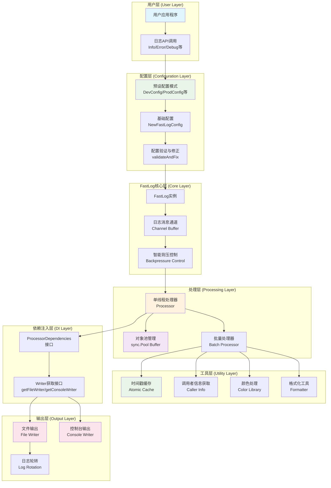

# package fastlog

**import** "gitee.com/MM-Q/fastlog"

## 模块说明

- **config.go** - 日志配置管理模块  
  定义日志配置结构体及配置项的设置与获取方法，负责管理FastLog的所有可配置参数。

- **fastlog.go** - FastLog日志记录器核心实现  
  提供日志记录器的创建、初始化、日志写入及关闭等核心功能，集成配置管理、缓冲区管理和日志处理流程。

- **internal.go** - FastLog内部实现文件  
  包含日志系统的核心内部功能实现，包括时间戳缓存、调用者信息获取、背压控制、日志消息处理和接口实现等，为FastLog提供高性能的底层支持。

- **processor.go** - 单线程日志处理器实现  
  负责从日志通道接收消息、批量缓存，并根据批次大小或时间间隔触发处理。

- **types.go** - 日志系统核心类型定义  
  定义FastLog的核心数据结构、常量和枚举类型，包括日志级别、日志格式、路径信息和日志消息结构体等。

## 核心架构概览

### 系统架构图



### 工作流程图


## VARIABLES

```go
var (
	// New 是 NewFastLog 的简写别名
	//
	// 用法:
	//  - logger := fastlog.New(config)
	//
	// 等价于:
	//  - logger := fastlog.NewFastLog(config)
	New = NewFastLog

	// NewCfg 是 NewFastLogConfig 的简写别名
	//
	// 用法:
	//  - config := fastlog.NewCfg()
	//
	// 等价于:
	//  - config := fastlog.NewFastLogConfig()
	NewCfg = NewFastLogConfig
)
```

为了提供更简洁的API调用方式，定义以下函数别名: 这样用户可以使用更短的函数名来创建日志实例和配置

## TYPES

### type FastLog

```go
type FastLog struct {
	// Has unexported fields.
}
```

FastLog 日志记录器

#### func NewFastLog

```go
func NewFastLog(config *FastLogConfig) *FastLog
```

NewFastLog 创建一个新的FastLog实例, 用于记录日志。

**参数:**
- config: 一个指向FastLogConfig实例的指针, 用于配置日志记录器。

**返回值:**
- *FastLog: 一个指向FastLog实例的指针。

#### func (*FastLog) Close

```go
func (f *FastLog) Close()
```

Close 安全关闭日志记录器

#### func (*FastLog) Debug

```go
func (f *FastLog) Debug(v ...any)
```

Debug 记录调试级别的日志，不支持占位符

**参数:**
- v: 可变参数，可以是任意类型，会被转换为字符串

#### func (*FastLog) Debugf

```go
func (f *FastLog) Debugf(format string, v ...any)
```

Debugf 记录调试级别的日志，支持占位符，格式化

**参数:**
- format: 格式字符串
- v: 可变参数，可以是任意类型，会被转换为字符串

#### func (*FastLog) Error

```go
func (f *FastLog) Error(v ...any)
```

Error 记录错误级别的日志，不支持占位符

**参数:**
- v: 可变参数，可以是任意类型，会被转换为字符串

#### func (*FastLog) Errorf

```go
func (f *FastLog) Errorf(format string, v ...any)
```

Errorf 记录错误级别的日志，支持占位符，格式化

**参数:**
- format: 格式字符串
- v: 可变参数，可以是任意类型，会被转换为字符串

#### func (*FastLog) Fatal

```go
func (f *FastLog) Fatal(v ...any)
```

Fatal 记录致命级别的日志，不支持占位符，发送后关闭日志记录器

**参数:**
- v: 可变参数，可以是任意类型，会被转换为字符串

#### func (*FastLog) Fatalf

```go
func (f *FastLog) Fatalf(format string, v ...any)
```

Fatalf 记录致命级别的日志，支持占位符，发送后关闭日志记录器

**参数:**
- format: 格式字符串
- v: 可变参数，可以是任意类型，会被转换为字符串

#### func (*FastLog) Info

```go
func (f *FastLog) Info(v ...any)
```

Info 记录信息级别的日志，不支持占位符

**参数:**
- v: 可变参数，可以是任意类型，会被转换为字符串

#### func (*FastLog) Infof

```go
func (f *FastLog) Infof(format string, v ...any)
```

Infof 记录信息级别的日志，支持占位符，格式化

**参数:**
- format: 格式字符串
- v: 可变参数，可以是任意类型，会被转换为字符串

#### func (*FastLog) Warn

```go
func (f *FastLog) Warn(v ...any)
```

Warn 记录警告级别的日志，不支持占位符

**参数:**
- v: 可变参数，可以是任意类型，会被转换为字符串

#### func (*FastLog) Warnf

```go
func (f *FastLog) Warnf(format string, v ...any)
```

Warnf 记录警告级别的日志，支持占位符，格式化

**参数:**
- format: 格式字符串
- v: 可变参数，可以是任意类型，会被转换为字符串

### type FastLogConfig

```go
type FastLogConfig struct {
	LogDirName      string        // 日志目录路径
	LogFileName     string        // 日志文件名
	OutputToConsole bool          // 是否将日志输出到控制台
	OutputToFile    bool          // 是否将日志输出到文件
	FlushInterval   time.Duration // 刷新间隔, 单位为time.Duration
	LogLevel        LogLevel      // 日志级别
	ChanIntSize     int           // 通道大小 默认10000
	LogFormat       LogFormatType // 日志格式选项
	Color           bool          // 是否启用终端颜色
	Bold            bool          // 是否启用终端字体加粗
	MaxLogFileSize  int           // 最大日志文件大小, 单位为MB, 默认10MB
	MaxLogAge       int           // 最大日志文件保留天数, 默认为0, 表示不做限制
	MaxLogBackups   int           // 最大日志文件保留数量, 默认为0, 表示不做限制
	IsLocalTime     bool          // 是否使用本地时间 默认使用UTC时间
	EnableCompress  bool          // 是否启用日志文件压缩 默认不启用
	BatchSize       int           // 批处理数量
}
```

FastLogConfig 定义一个配置结构体, 用于配置日志记录器

#### func ConsoleConfig

```go
func ConsoleConfig() *FastLogConfig
```

ConsoleConfig 控制台模式配置 特点：
- 纯控制台：仅控制台输出，无文件存储，适合临时调试
- 视觉友好：彩色+加粗显示，Basic格式简洁易读
- 快速响应：小缓冲区(5000)，快刷新(100ms)，小批处理(500)
- 轻量级：INFO级别，无文件操作开销
- 即时性：适合开发调试、脚本运行等临时场景

**返回值:**
- *FastLogConfig: 控制台模式配置实例

#### func DevConfig

```go
func DevConfig(logDirName, logFileName string) *FastLogConfig
```

DevConfig 开发模式配置 特点：
- 双输出：控制台+文件同时输出，便于实时查看和持久化存储
- 详细信息：DEBUG级别日志，Detailed格式，包含完整调用信息
- 快速响应：100ms快速刷新，立即看到日志输出
- 彩色显示：控制台彩色+加粗，提升开发体验
- 短期保留：7天保留期，10个备份文件，节省开发环境存储

**参数:**
- logDirName: 日志目录名称
- logFileName: 日志文件名称

**返回值:**
- *FastLogConfig: 开发模式配置实例

#### func FileConfig

```go
func FileConfig(logDirName, logFileName string) *FastLogConfig
```

FileConfig 文件模式配置 特点：
- 纯文件：仅文件输出，无控制台干扰，适合后台服务
- 结构化：BasicStructured格式，平衡可读性和解析性
- 中等性能：标准缓冲区和刷新间隔，平衡性能和实时性
- 中期存储：14天保留期，30个备份文件，适合一般业务
- 无装饰：关闭颜色和加粗，纯净文件输出

**参数:**
- logDirName: 日志目录名称
- logFileName: 日志文件名称

**返回值:**
- *FastLogConfig: 文件模式配置实例

#### func NewFastLogConfig

```go
func NewFastLogConfig(logDirName string, logFileName string) *FastLogConfig
```

NewFastLogConfig 创建一个新的FastLogConfig实例, 用于配置日志记录器。

**参数:**
- logDirName: 日志目录名称, 默认为"applogs"。
- logFileName: 日志文件名称, 默认为"app.log"。

**返回值:**
- *FastLogConfig: 一个指向FastLogConfig实例的指针。

#### func ProdConfig

```go
func ProdConfig(logDirName, logFileName string) *FastLogConfig
```

ProdConfig 生产模式配置 特点：
- 高性能：仅文件输出，大缓冲区(20000)，慢刷新(1000ms)，大批处理(2000)
- 结构化：JSON格式便于日志分析系统解析和索引
- 合理级别：INFO级别过滤调试信息，减少日志量
- 长期存储：30天保留期，100个备份文件，满足审计要求
- 空间优化：启用压缩减少磁盘占用
- 无装饰：关闭颜色和加粗，纯净输出

**参数:**
- logDirName: 日志目录名称
- logFileName: 日志文件名称

**返回值:**
- *FastLogConfig: 生产模式配置实例

#### func SilentConfig

```go
func SilentConfig(logDirName, logFileName string) *FastLogConfig
```

SilentConfig 静默模式配置 特点：
- 最小输出：仅WARN级别，只记录警告和错误，极大减少日志量
- 极致性能：大缓冲区(20000)，最慢刷新(1000ms)，大批处理(2000)
- 高效格式：JsonSimple简化JSON，减少序列化开销
- 长期存储：30天保留期，50个备份文件，重要信息不丢失
- 空间优化：启用压缩，最大化存储效率
- 适用场景：高并发生产环境，性能敏感应用

**参数:**
- logDirName: 日志目录名称
- logFileName: 日志文件名称

**返回值:**
- *FastLogConfig: 静默模式配置实例

### type LogFormatType

```go
type LogFormatType int
```

日志格式选项

```go
const (
	// 详细格式
	Detailed LogFormatType = iota

	// json格式
	Json

	// json简化格式(无文件信息)
	JsonSimple

	// 简约格式(无文件信息)
	Simple

	// 结构化格式
	Structured

	// 基础结构化格式(无文件信息)
	BasicStructured

	// 简单时间格式(无文件信息)
	SimpleTimestamp

	// 自定义格式(无文件信息)
	Custom
)
```

日志格式选项

### type LogLevel

```go
type LogLevel uint8
```

日志级别枚举

```go
const (
	DEBUG LogLevel = 10  // 调试级别
	INFO  LogLevel = 20  // 信息级别
	WARN  LogLevel = 30  // 警告级别
	ERROR LogLevel = 40  // 错误级别
	FATAL LogLevel = 50  // 致命级别
	NONE  LogLevel = 255 // 无日志级别
)
```

定义日志级别

#### func (LogLevel) MarshalJSON

```go
func (l LogLevel) MarshalJSON() ([]byte, error)
```

将日志级别转换为字符串

### type ProcessorConfig

```go
type ProcessorConfig struct {
	BatchSize     int           // 批量处理大小
	FlushInterval time.Duration // 刷新间隔
}
```

ProcessorConfig 处理器配置结构

### type WriterPair

```go
type WriterPair struct {
	FileWriter    io.Writer
	ConsoleWriter io.Writer
}
```

WriterPair 写入器对，用于批量传递写入器