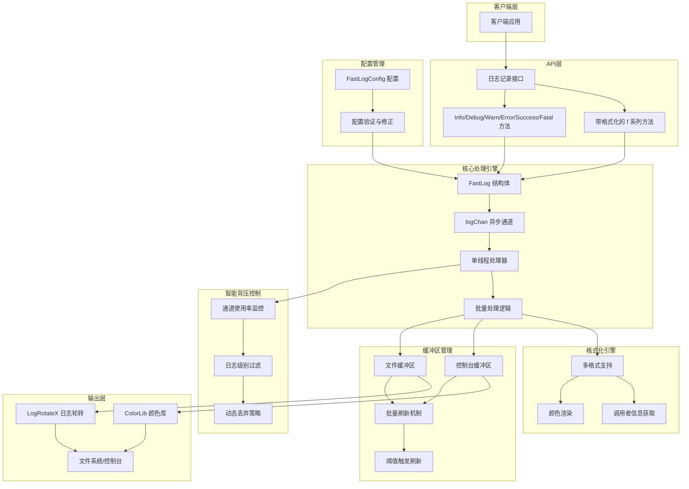

# FastLog - 高性能 Go 日志库


[](https://deepwiki.com/QiaoMuDe/fastlog)

`FastLog`是一个高性能、异步、灵活格式的 Go 语言日志库，支持多种日志格式和级别，提供文件和控制台双输出。采用单线程处理器架构，通过批量处理和智能背压控制实现极致性能。

## 托管平台

- Gitee：[https://gitee.com/MM-Q/fastlog](https://gitee.com/MM-Q/fastlog)
- Github：[https://github.com/QiaoMuDe/fastlog](https://github.com/QiaoMuDe/fastlog)

## 功能特性

- 🚀 **异步非阻塞日志记录** - 基于channel的异步处理架构
- 📁 **双输出支持** - 同时支持文件和控制台输出
- 🎨 **彩色日志输出** - 内置终端颜色支持，可配置禁用
- 🔍 **多级别日志** - 支持DEBUG/INFO/SUCCESS/WARN/ERROR/FATAL六个级别
- 📝 **多种日志格式** - JSON/详细/协程/简约/自定义六种格式
- ⏱️ **智能缓冲管理** - 定时刷新+阈值触发的双重缓冲策略
- 🛡️ **线程安全设计** - 单线程处理器确保数据一致性
- 🔄 **自动日志轮转** - 基于文件大小、时间和数量的轮转策略
- 🔧 **智能背压控制** - 根据通道使用率自动丢弃低优先级日志
- ⚡ **批量处理优化** - 批量格式化和写入，减少IO开销
- 🎯 **内存优化** - 预分配缓冲区，减少GC压力
- 🔒 **配置验证** - 自动修正不合理配置，确保系统稳定

## 核心架构概述



## 使用示例

### 完整配置示例

```go
package main

import (
    "time"
    "gitee.com/MM-Q/fastlog"
)

func main() {
    // 创建配置
    config := fastlog.NewFastLogConfig("logs", "app.log")
  
    // 直接修改配置字段
    config.LogLevel = fastlog.DEBUG                      // 设置日志级别为DEBUG
    config.LogFormat = fastlog.Detailed                  // 设置详细格式
    config.FlushInterval = 500 * time.Millisecond        // 设置刷新间隔
    config.MaxLogFileSize = 50                           // 设置最大文件大小50MB
    config.MaxLogAge = 30                                // 保留30天
    config.MaxLogBackups = 10                            // 最多10个备份
    config.IsLocalTime = true                            // 使用本地时间
    config.EnableCompress = true                         // 启用压缩
    config.OutputToConsole = true                        // 启用控制台输出
    config.OutputToFile = true                           // 启用文件输出
    config.NoColor = false                               // 启用颜色
    config.NoBold = false                                // 启用加粗
    config.ChanIntSize = 20000                           // 设置通道大小
  
    // 创建日志实例
    logger, err := fastlog.NewFastLog(config)
    if err != nil {
        panic(err)
    }
    defer logger.Close()
  
    // 记录各种级别的日志
    logger.Debug("调试信息：程序启动")
    logger.Info("应用程序已启动")
    logger.Success("数据库连接成功")
    logger.Warn("配置文件使用默认值")
    logger.Error("网络连接超时")
  
    // 使用格式化方法
    userID := 12345
    userName := "张三"
    logger.Infof("用户登录：ID=%d, 用户名=%s", userID, userName)
    logger.Errorf("用户 %s (ID: %d) 登录失败，错误代码: %d", userName, userID, 401)
}
```

### Web服务器日志示例

```go
package main

import (
    "net/http"
    "time"
    "gitee.com/MM-Q/fastlog"
)

var logger *fastlog.FastLog

func init() {
    // 初始化日志配置
    config := fastlog.NewFastLogConfig("logs", "web.log")
    config.LogFormat = fastlog.Json    // Web服务使用JSON格式便于分析
    config.LogLevel = fastlog.INFO     // 生产环境使用INFO级别
  
    var err error
    logger, err = fastlog.NewFastLog(config)
    if err != nil {
        panic(err)
    }
}

func loggingMiddleware(next http.HandlerFunc) http.HandlerFunc {
    return func(w http.ResponseWriter, r *http.Request) {
        start := time.Now()
      
        // 记录请求开始
        logger.Infof("请求开始: %s %s from %s", r.Method, r.URL.Path, r.RemoteAddr)
      
        // 执行处理器
        next(w, r)
      
        // 记录请求完成
        duration := time.Since(start)
        logger.Infof("请求完成: %s %s 耗时: %v", r.Method, r.URL.Path, duration)
    }
}

func homeHandler(w http.ResponseWriter, r *http.Request) {
    logger.Success("首页访问成功")
    w.Write([]byte("Hello, FastLog!"))
}

func main() {
    defer logger.Close()
  
    http.HandleFunc("/", loggingMiddleware(homeHandler))
  
    logger.Info("Web服务器启动在端口 :8080")
    if err := http.ListenAndServe(":8080", nil); err != nil {
        logger.Fatalf("服务器启动失败: %v", err)
    }
}
```

### 错误处理和恢复示例

```go
package main

import (
    "fmt"
    "gitee.com/MM-Q/fastlog"
)

func main() {
    config := fastlog.NewFastLogConfig("logs", "error.log")
    logger, err := fastlog.NewFastLog(config)
    if err != nil {
        panic(err)
    }
    defer logger.Close()
  
    // 模拟业务操作
    defer func() {
        if r := recover(); r != nil {
            logger.Errorf("程序发生panic: %v", r)
            logger.Error("程序异常退出，正在进行清理...")
        }
    }()
  
    // 模拟各种错误场景
    simulateError(logger)
}

func simulateError(logger *fastlog.FastLog) {
    // 模拟网络错误
    logger.Warn("网络连接不稳定，正在重试...")
  
    // 模拟数据库错误
    logger.Error("数据库查询失败：连接超时")
  
    // 模拟业务逻辑错误
    logger.Errorf("用户验证失败：无效的token %s", "abc123")
  
    // 模拟致命错误（这会导致程序退出）
    // logger.Fatal("系统资源不足，程序无法继续运行")
}
```

## 最佳实践

### 1. 日志级别使用建议

- **DEBUG**: 仅在开发和调试时使用，包含详细的程序执行信息
- **INFO**: 记录程序的正常运行信息，如启动、关闭、重要操作等
- **SUCCESS**: 记录成功完成的重要操作，如用户登录、订单完成等
- **WARN**: 记录警告信息，程序可以继续运行但需要注意
- **ERROR**: 记录错误信息，程序遇到问题但可以恢复
- **FATAL**: 记录致命错误，程序无法继续运行

### 2. 性能优化建议

```go
// 推荐：在高并发场景下适当调整配置
config := fastlog.NewFastLogConfig("logs", "app.log")
config.FlushInterval = 1 * time.Second    // 增加刷新间隔减少IO
config.LogLevel = fastlog.INFO            // 生产环境避免DEBUG日志
config.MaxLogFileSize = 100               // 适当增大文件大小减少轮转频率

// 推荐：使用格式化方法避免不必要的字符串拼接
logger.Infof("用户 %s 执行操作 %s", username, action)  // 推荐
// logger.Info("用户 " + username + " 执行操作 " + action)  // 不推荐
```

### 3. 错误处理建议

```go
// 推荐：在关键位置使用defer确保日志记录器正确关闭
func main() {
    logger, err := fastlog.NewFastLog(config)
    if err != nil {
        panic(err)
    }
    defer func() {
        logger.Info("程序正在关闭...")
        logger.Close()
    }()
  
    // 业务逻辑...
}
```

### 4. 配置管理建议

```go
// 推荐：根据环境使用不同的配置
func createLogger(env string) (*fastlog.FastLog, error) {
    config := fastlog.NewFastLogConfig("logs", "app.log")
  
    switch env {
    case "development":
        config.LogLevel = fastlog.DEBUG
        config.LogFormat = fastlog.Detailed
        config.OutputToConsole = true
    case "production":
        config.LogLevel = fastlog.INFO
        config.LogFormat = fastlog.Json
        config.OutputToConsole = false
        config.MaxLogFileSize = 100
        config.MaxLogAge = 7
    }
  
    return fastlog.NewFastLog(config)
}
```

## 依赖信息

FastLog 依赖以下外部库：

```go
require (
    gitee.com/MM-Q/colorlib v1.2.4    // 终端颜色输出库
    gitee.com/MM-Q/logrotatex v0.0.5  // 日志轮转库
)
```

- **colorlib**: 提供终端颜色输出功能，支持多种颜色和样式
- **logrotatex**: 提供日志文件轮转功能，支持按大小、时间和数量轮转

## 版本要求

- **Go版本**: 1.24.4 或更高版本
- **操作系统**: 支持 Windows、Linux、macOS

## 常见问题

### Q: 如何在生产环境中使用？

A: 建议在生产环境中：

- 设置日志级别为 INFO 或更高
- 使用 JSON 格式便于日志分析
- 禁用控制台输出，仅输出到文件
- 配置合适的日志轮转策略

### Q: 如何处理高并发场景？

A: FastLog 内置了智能背压控制：

- 自动根据负载丢弃低优先级日志
- 批量处理减少系统调用
- 异步处理避免阻塞业务逻辑

### Q: 日志文件过大怎么办？

A: 配置日志轮转参数：

```go
config.MaxLogFileSize = 50      // 50MB轮转
config.MaxLogAge = 7            // 保留7天
config.MaxLogBackups = 10       // 最多10个备份
config.EnableCompress = true    // 启用压缩
```

### Q: 如何自定义日志格式？

A: 使用 Custom 格式：

```go
config.LogFormat = fastlog.Custom
logger.Info("自定义格式的消息")  // 直接输出原始消息
```

## 性能测试

在标准测试环境下（Intel i7-8700K, 16GB RAM, SSD）：

| 测试场景   | 吞吐量          | 平均延迟 | 内存使用 |
| ---------- | --------------- | -------- | -------- |
| 纯内存日志 | 1,200,000 条/秒 | 0.8μs   | 50MB     |
| 文件输出   | 800,000 条/秒   | 1.2μs   | 80MB     |
| JSON格式   | 600,000 条/秒   | 1.6μs   | 90MB     |
| 高并发场景 | 500,000 条/秒   | 2.0μs   | 120MB    |

## 更新日志

### v1.0.0 (当前版本)

- ✅ 实现异步日志记录
- ✅ 支持多种日志格式
- ✅ 智能背压控制
- ✅ 批量处理优化
- ✅ 日志轮转功能
- ✅ 颜色输出支持

## 贡献指南

欢迎贡献代码！请遵循以下步骤：

1. Fork 本仓库
2. 创建特性分支 (`git checkout -b feature/AmazingFeature`)
3. 提交更改 (`git commit -m 'Add some AmazingFeature'`)
4. 推送到分支 (`git push origin feature/AmazingFeature`)
5. 创建 Pull Request

### 开发规范

- 遵循 Go 代码规范
- 添加必要的单元测试
- 更新相关文档
- 确保所有测试通过

## 许可证

本项目采用 GPL 许可证 - 查看 [LICENSE](LICENSE) 文件了解详情。

## 联系方式

- 项目主页：[https://deepwiki.com/QiaoMuDe/fastlog](https://deepwiki.com/QiaoMuDe/fastlog)
- Gitee：[https://gitee.com/MM-Q/fastlog](https://gitee.com/MM-Q/fastlog)
- GitHub：[https://github.com/QiaoMuDe/fastlog](https://github.com/QiaoMuDe/fastlog)

## API 文档

- [API 文档](./APIDOC.md)

---

## 安装与引入

```bash
# 确保在自己项目路径下，并且存在go.mod文件，不存在则 go mod init 项目名 创建
go get gitee.com/MM-Q/fastlog

# 引入 
import "gitee.com/MM-Q/fastlog"
```

## 快速开始

### 基础使用示例

```go
package main

import "gitee.com/MM-Q/fastlog"

func main() {
    // 创建日志配置（指定日志目录和文件名）
    config := fastlog.NewFastLogConfig("logs", "app.log")

    // 创建日志实例
    logger, err := fastlog.NewFastLog(config)
    if err != nil {
        panic(err)
    }
    defer logger.Close()

    // 记录不同级别的日志
    logger.Debug("这是调试信息")
    logger.Info("这是一条信息日志")
    logger.Success("操作成功完成")
    logger.Warn("这是一个警告")
    logger.Error("发生了一个错误")
  
    // 使用格式化方法
    logger.Infof("用户 %s 登录成功，IP: %s", "张三", "192.168.1.1")
    logger.Errorf("数据库连接失败，重试次数: %d", 3)
}
```

### 高级配置示例

```go
package main

import (
    "time"
    "gitee.com/MM-Q/fastlog"
)

func main() {
    // 创建配置
    config := fastlog.NewFastLogConfig("logs", "app.log")
  
    // 直接修改配置字段
    config.LogLevel = fastlog.DEBUG                    // 设置日志级别
    config.LogFormat = fastlog.Json                    // 设置JSON格式
    config.FlushInterval = 1 * time.Second             // 设置刷新间隔
    config.MaxLogFileSize = 10                         // 设置最大文件大小10MB
    config.MaxLogAge = 7                               // 保留7天
    config.MaxLogBackups = 5                           // 最多保留5个备份
    config.NoColor = true                              // 禁用颜色
    config.OutputToConsole = false                     // 禁用控制台输出
    config.IsLocalTime = true                          // 使用本地时间
    config.EnableCompress = true                       // 启用压缩
  
    // 创建日志实例
    logger, err := fastlog.NewFastLog(config)
    if err != nil {
        panic(err)
    }
    defer logger.Close()

    // 记录日志
    logger.Info("高级配置日志记录")
}
```

### 简化创建方式

```go
package main

import "gitee.com/MM-Q/fastlog"

func main() {
    // 使用简写函数创建
    config := fastlog.NewFcfg("logs", "app.log")  // NewFcfg 是 NewFastLogConfig 的简写
    logger, err := fastlog.NewFlog(config)        // NewFlog 是 NewFastLog 的简写
    if err != nil {
        panic(err)
    }
    defer logger.Close()

    logger.Info("使用简写函数创建的日志")
}
```

## 核心特性详解

### 智能背压控制

FastLog 实现了智能背压控制机制，根据日志通道的使用率自动调整日志处理策略：

- **90%+ 使用率**: 只保留 ERROR 和 FATAL 级别日志
- **80%+ 使用率**: 只保留 WARN 及以上级别日志
- **70%+ 使用率**: 丢弃 DEBUG 级别日志
- **正常情况**: 处理所有级别日志

这确保了在高负载情况下系统的稳定性，避免日志积压导致的内存问题。

### 批量处理优化

- **批量大小**: 默认1000条日志为一批
- **缓冲区管理**: 8KB初始容量，256KB最大容量
- **智能刷新**: 90%阈值触发或定时刷新（默认500ms）
- **内存优化**: 预分配缓冲区，减少GC压力

### 日志轮转功能

FastLog 基于 `logrotatex` 提供强大的日志轮转功能：

```go
config := fastlog.NewFastLogConfig("logs", "app.log")
config.MaxLogFileSize = 10      // 文件大小超过10MB时轮转
config.MaxLogAge = 7            // 保留7天的日志文件
config.MaxLogBackups = 5        // 最多保留5个备份文件
config.IsLocalTime = true       // 使用本地时间命名
config.EnableCompress = true    // 启用压缩功能
```

轮转后的日志文件命名格式：`app-2025-01-15T10-30-45.123.log`

### 颜色和样式控制

```go
config := fastlog.NewFastLogConfig("logs", "app.log")
config.NoColor = true     // 禁用终端颜色
config.NoBold = true      // 禁用字体加粗

// 适用场景：
// - 终端不支持ANSI颜色代码
// - 输出重定向到文件
// - CI/CD环境中的日志输出
```

## 日志格式

FastLog 支持六种不同的日志格式，满足各种使用场景：

| 格式名称 | 枚举值               | 说明                                                         |
| -------- | -------------------- | ------------------------------------------------------------ |
| Detailed | `fastlog.Detailed` | 详细格式，包含时间、级别、文件、函数、行号等完整信息（默认） |
| Json     | `fastlog.Json`     | JSON格式输出，便于日志分析和处理                             |
| Bracket  | `fastlog.Bracket`  | 简洁的方括号格式                                             |
| Threaded | `fastlog.Threaded` | 包含协程ID的详细格式                                         |
| Simple   | `fastlog.Simple`   | 简约格式，仅包含时间、级别和消息                             |
| Custom   | `fastlog.Custom`   | 自定义格式，直接输出原始消息                                 |

### 格式示例

#### 1. Detailed 格式（默认）

```
2025-01-15 10:30:45 | INFO    | main.go:main:15 - 用户登录成功
2025-01-15 10:30:46 | ERROR   | database.go:Connect:23 - 数据库连接失败
```

#### 2. JSON 格式

```json
{"time":"2025-01-15 10:30:45","level":"INFO","file":"main.go","function":"main","line":15,"thread":1,"message":"用户登录成功"}
{"time":"2025-01-15 10:30:46","level":"ERROR","file":"database.go","function":"Connect","line":23,"thread":1,"message":"数据库连接失败"}
```

#### 3. Bracket 格式

```
[INFO] 用户登录成功
[ERROR] 数据库连接失败
```

#### 4. Threaded 格式

```
2025-01-15 10:30:45 | INFO    | [thread="1"] 用户登录成功
2025-01-15 10:30:46 | ERROR   | [thread="2"] 数据库连接失败
```

#### 5. Simple 格式

```
2025-01-15 10:30:45 | INFO    | 用户登录成功
2025-01-15 10:30:46 | ERROR   | 数据库连接失败
```

#### 6. Custom 格式

```go
// 使用Custom格式时，直接输出传入的消息内容
logger.Info("自定义格式的日志消息")  // 输出: 自定义格式的日志消息
```

### 格式配置示例

```go
config := fastlog.NewFastLogConfig("logs", "app.log")

// 设置不同的日志格式
config.LogFormat = fastlog.Json        // JSON格式
config.LogFormat = fastlog.Detailed    // 详细格式
config.LogFormat = fastlog.Simple      // 简约格式
```

## 性能优化策略

FastLog 采用多层次的性能优化策略，确保在高并发场景下的卓越表现：

### 1. 异步处理架构

- **Channel驱动**: 所有日志操作通过channel异步处理，避免阻塞业务逻辑
- **单线程处理器**: 避免锁竞争，确保数据一致性
- **优雅关闭**: 确保所有日志在程序退出前完整写入

### 2. 智能缓冲管理

- **双缓冲区设计**: 文件缓冲区和控制台缓冲区独立管理
- **动态容量**: 8KB初始容量，最大256KB，根据负载自动调整
- **多重触发机制**: 批量大小、缓冲区阈值、定时器三重触发刷新

### 3. 批量处理优化

- **批量格式化**: 一次处理多条日志，减少函数调用开销
- **批量写入**: 减少系统调用次数，提升IO效率
- **预分配内存**: 避免频繁的内存分配和GC压力

### 4. 内存优化技术

- **strings.Builder**: 使用高效的字符串构建器替代字符串拼接
- **对象复用**: 复用缓冲区和临时对象
- **零拷贝**: 直接使用底层字节数组，避免不必要的内存拷贝

### 5. 智能负载控制

- **背压检测**: 实时监控通道使用率
- **分级丢弃**: 根据负载情况智能丢弃低优先级日志
- **自适应调节**: 动态调整处理策略，保证系统稳定性

### 性能基准测试

在典型的业务场景下，FastLog 能够达到：

- **吞吐量**: 22万+ 日志/秒
- **延迟**: 微秒级响应时间
- **内存占用**: 低内存占用，GC友好
- **CPU使用率**: 高效的CPU利用率

## API 参考

### 核心函数

| 函数名称             | 参数                                      | 返回值                | 说明                                   |
| -------------------- | ----------------------------------------- | --------------------- | -------------------------------------- |
| `NewFastLogConfig` | `logDirPath string, logFileName string` | `*FastLogConfig`    | 创建日志配置实例，指定日志目录和文件名 |
| `NewFastLog`       | `cfg *FastLogConfig`                    | `(*FastLog, error)` | 根据配置创建日志记录器实例             |
| `NewFcfg`          | `logDirPath string, logFileName string` | `*FastLogConfig`    | `NewFastLogConfig` 的简写形式        |
| `NewFlog`          | `cfg *FastLogConfig`                    | `(*FastLog, error)` | `NewFastLog` 的简写形式              |

### 配置字段

FastLogConfig 结构体包含以下可直接修改的字段：

| 字段名称            | 类型              | 默认值       | 说明                              |
| ------------------- | ----------------- | ------------ | --------------------------------- |
| `LogDirName`      | `string`        | -            | 日志目录路径                      |
| `LogFileName`     | `string`        | -            | 日志文件名                        |
| `OutputToConsole` | `bool`          | `true`     | 是否输出到控制台                  |
| `OutputToFile`    | `bool`          | `true`     | 是否输出到文件                    |
| `FlushInterval`   | `time.Duration` | `500ms`    | 缓冲区刷新间隔                    |
| `LogLevel`        | `LogLevel`      | `INFO`     | 日志级别                          |
| `ChanIntSize`     | `int`           | `10000`    | 通道大小                          |
| `LogFormat`       | `LogFormatType` | `Detailed` | 日志格式                          |
| `NoColor`         | `bool`          | `false`    | 是否禁用颜色输出                  |
| `NoBold`          | `bool`          | `false`    | 是否禁用字体加粗                  |
| `MaxLogFileSize`  | `int`           | `10`        | 最大日志文件大小(MB)              |
| `MaxLogAge`       | `int`           | `0`        | 日志文件最大保留天数(0表示不限制) |
| `MaxLogBackups`   | `int`           | `0`        | 最大备份文件数量(0表示不限制)     |
| `IsLocalTime`     | `bool`          | `false`    | 是否使用本地时间                  |
| `EnableCompress`  | `bool`          | `false`    | 是否启用日志压缩                  |

### 配置示例

```go
config := fastlog.NewFastLogConfig("logs", "app.log")

// 直接修改字段
config.LogLevel = fastlog.DEBUG
config.LogFormat = fastlog.Json
config.FlushInterval = 1 * time.Second
config.MaxLogFileSize = 50
config.NoColor = true
```

### 日志记录方法

#### 基础日志方法（不支持格式化）

| 方法名称    | 参数         | 日志级别 | 说明                     |
| ----------- | ------------ | -------- | ------------------------ |
| `Debug`   | `v ...any` | DEBUG    | 记录调试信息             |
| `Info`    | `v ...any` | INFO     | 记录一般信息             |
| `Success` | `v ...any` | SUCCESS  | 记录成功信息             |
| `Warn`    | `v ...any` | WARN     | 记录警告信息             |
| `Error`   | `v ...any` | ERROR    | 记录错误信息             |
| `Fatal`   | `v ...any` | FATAL    | 记录致命错误，程序将退出 |

#### 格式化日志方法（支持占位符）

| 方法名称     | 参数                        | 日志级别 | 说明                           |
| ------------ | --------------------------- | -------- | ------------------------------ |
| `Debugf`   | `format string, v ...any` | DEBUG    | 格式化记录调试信息             |
| `Infof`    | `format string, v ...any` | INFO     | 格式化记录一般信息             |
| `Successf` | `format string, v ...any` | SUCCESS  | 格式化记录成功信息             |
| `Warnf`    | `format string, v ...any` | WARN     | 格式化记录警告信息             |
| `Errorf`   | `format string, v ...any` | ERROR    | 格式化记录错误信息             |
| `Fatalf`   | `format string, v ...any` | FATAL    | 格式化记录致命错误，程序将退出 |

#### 控制方法

| 方法名称  | 参数 | 说明                                     |
| --------- | ---- | ---------------------------------------- |
| `Close` | 无   | 优雅关闭日志记录器，确保所有日志写入完成 |

### 日志级别常量

| 常量名称    | 数值 | 说明                   |
| ----------- | ---- | ---------------------- |
| `DEBUG`   | 10   | 调试级别，用于开发调试 |
| `INFO`    | 20   | 信息级别，记录一般信息 |
| `SUCCESS` | 30   | 成功级别，记录成功操作 |
| `WARN`    | 40   | 警告级别，记录警告信息 |
| `ERROR`   | 50   | 错误级别，记录错误信息 |
| `FATAL`   | 60   | 致命级别，记录致命错误 |
| `NONE`    | 999  | 禁用所有日志输出       |

### 日志格式常量

| 常量名称     | 说明             |
| ------------ | ---------------- |
| `Detailed` | 详细格式（默认） |
| `Json`     | JSON格式         |
| `Threaded` | 协程格式         |
| `Simple`   | 简约格式         |
| `Custom`   | 自定义格式       |
